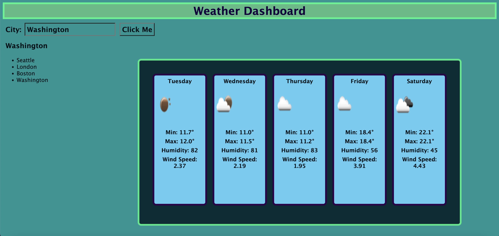

# Weather-Forcast-Project

Use the [5 Day Weather Forecast](https://openweathermap.org/forecast5) to retrieve weather data for cities. The base URL should look like the following: `https://api.openweathermap.org/data/2.5/forecast?lat={lat}&lon={lon}&appid={API key}`. After registering for a new API key, you may need to wait up to 2 hours for that API key to activate.

Fetching the latitudes and longitudes from geocoding API and then passing them as parameters for openweather API call.

URL to website:https://shreyamishra9618.github.io/Weather-Forcast-Project/

The following image shows the web application's appearance and functionality:

## Summary
* HTML and CSS and Javascript documents create a weather application
* This project emphasizes the use of using an API call and JQuery to make dynamic changes to an HMTL document
* This project utilizes the use of appending HTML pages
## This project has the following features:
* A Search bar for the city location
* A card that provides the current weather  Location, Temp, Humidity, Wind Speed
* Card that provides a five day forecast
